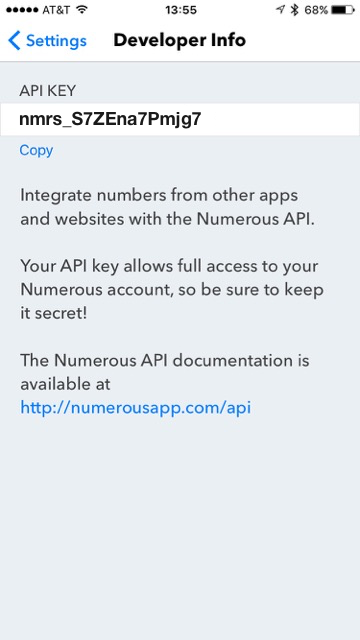

# numerous

[Numerous](http://numerousapp.com) is a service for sharing and following numbers such as stock prices, temperatures, the number of processes running on a server, or the number of times you've visited the gym this week.
This package allows you to create, modify, and interact with data on numerous quickly and easily from within R through the [Numerous API](https://developer.numerousapp.com).

## Installation

This package is not quite ready to be available on [CRAN](http://cran.r-project.org), but you can use [devtools](http://cran.r-project.org/web/packages/devtools/index.html) to install the current development version:

    devtools::install_github('briandconnelly/numerous')

## First: Getting Your API key

Before you can interact with Numerous, you'll need to get your key.
Launch the mobile application ([iOS](https://itunes.apple.com/us/app/numerous-lifes-most-important/id797642904?mt=8), [Android](https://play.google.com/store/apps/details?id=com.numerousapp)), and go to *Settings* and *Developer Info*.

In this screenshot, we see that our API key is **nmrs_S7ZEna7Pmjg7**.
Keep this number handy, as you'll need it right away.
Optionally, you can save the key in your environment as `NUMEROUS_API_KEY` (or whatever else you'd like).

## Related Projects

- [Python Implementation](https://github.com/outofmbufs/Nappy) by [Neil Webber](http://www.neilwebber.com/)
- [Ruby Implementation](https://github.com/outofmbufs/numeruby) by [Neil Webber](http://www.neilwebber.com/)

## Code of Conduct

This project is released with a [Contributor Code of Conduct](CONDUCT.md). By participating in this project you agree to abide by its terms.

## Disclaimer

This package and its author are in no way affiliated with [Numerous, Inc.](http://numerousapp.com).

